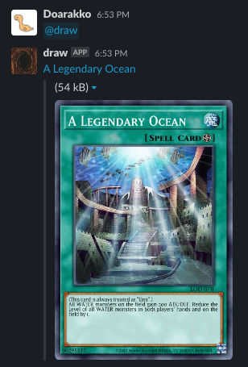

# draw-bolt

Draw Yu-Gi-Oh! Card on Slack.



## Requirements

- Slack account
- AWS account
- Serverless Framework CLI

## Deploy

```bash
serverless deploy
```

## Credits

- [Yu-Gi-Oh! API by YGOPRODeck](https://ygoprodeck.com/api-guide/)
